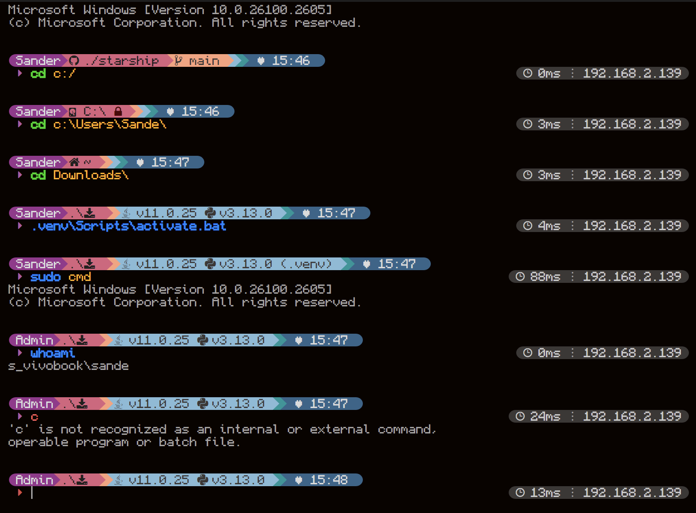

# StarshipConfig

This is my personal Starship configuration file, feel free to copy and modify it!

## The theme was inspired by the official [Pastel Powerline preset](https://starship.rs/presets/pastel-powerline#pastel-powerline-preset)

### Requirements

- You must have [starship](https://starship.rs/guide/) installed for this theme to work at all
- You must have an [Nerd Font](https://www.nerdfonts.com/font-downloads) installed on you're machine, I based this theme around the unoffical official [Monocraft Nerd Font Patch](https://github.com/IdreesInc/Monocraft/releases)
  - *After installing you must restart all the places that you you want to add the font to*
- You must have the or a Nerd Font added to you're terminal or where ever you want it (like the vscode terminal)
  - For Windows Terminal:
    - Head to your settings, you can do this by pressing `Ctrl + ,` when you have the terminal open
    - Head to `Defaults`
    - Click on `Appearance`
    - Add your Nerd font in the `Font face` box, may have to show all fonts for it to show up
  - For VSCode:
    - Head into your settings
    - Search for `Font` in the search balk
    - Find the setting for `Terminal > Integrated: Font Family`
    - Add the Nerd Font here one of the first (if its not the first, only the icons will be visable)

### installation

- Clone this repo and add `starship.toml` to your config file located at: `~/.config/starship/`. You can either copy the contents or replace the file
- Restart your terminal if it does not load.

## Previews

### Preview 1

